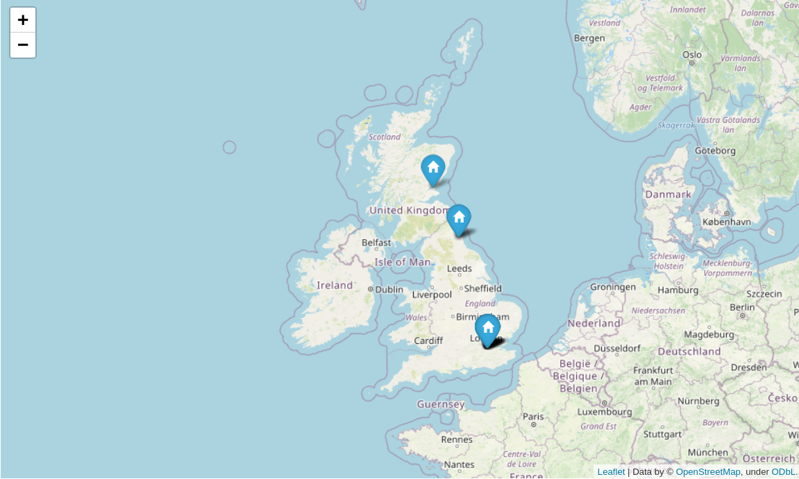
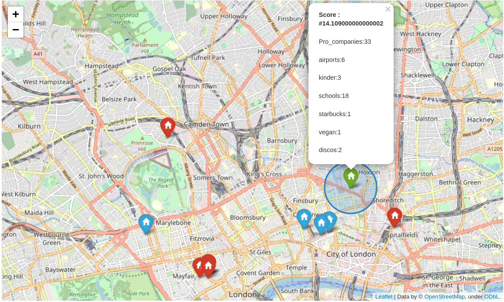

# Best location for your gaming company: 
the mongo-project

Ironhack project on mongodb queries

In this project, I will select the best location in England for the main office of our company according to certain 'neccesities' of the staff.

## **Filtering**
All the stuff had a meeting to select the best place to start the new company. I was chosen to find it. By prioritizing the staff requests, I made a series of hierarchical filters to get to the right location. It was like this:
###  ***We are going to England!***
Since virtually all the staff were from **England**, the first decission was choosing a location within that country. I used mongo queries from `pymongo` to filter to companies with offices in England. Those were my candidate offices.
### ***Developers need a good enterprise network*** 
One of the first point in the meeting was that developers refuse to be aisolated from top companies in technologies. Developers are maybe the best asset in the company, therefore, I used `pymongo` to select offices with top tech companies in a 5km radius. 
### ***Travelling for account managers***
Accaunt managers and other staff must travell a lot. And those are big spenses, specially if there is no nearby way to travel. So is best to pick a place with good conexion to international airports. I used the Google Places API to find the offices within 20 km of an international airport.
### ***We have lots of children!***
A 30% of the staff had at least one kid. It was important to find places with kindergartens and primary schools in 1km radius. Again, the Google Places API did the job. 
### ***Executives and their Starbucks***
After trimming the candidate offices by a lot, executives refused to be in a place without starbucks. I used a kaggle dataset to extract the location of the starbuck stores and select the candidate offices with a starbuck within 200 m. 
### ***A vegan restaurant for the CEO*** 
Of course, if the executives got Starbucks, the CEO demanded a vegetarian restaurant. Luckily, veggy restaurants and Starbucks are usually not far appart.
### ***Friday party***
Finally, there is the tradition of going out for party on Friday evening. And noone wants to walk very far. I filtered for offices with night-clubs around. 

I ended up with 17 candidates in three english cities that were scored according to a function that gives value to each category depending on how many people was affected to it

## **The final decision**
According to its final score, the final venue was in **London**.
Specifically in ***Nelson Passage London United Kingdom EC1V2QY***

Note: You can see an online version of the interactive map by copying and pasting its [htm code](/OUTPUT/html_map.html) in an online html viewer like: 
https://codebeautify.org/htmlviewer/#
